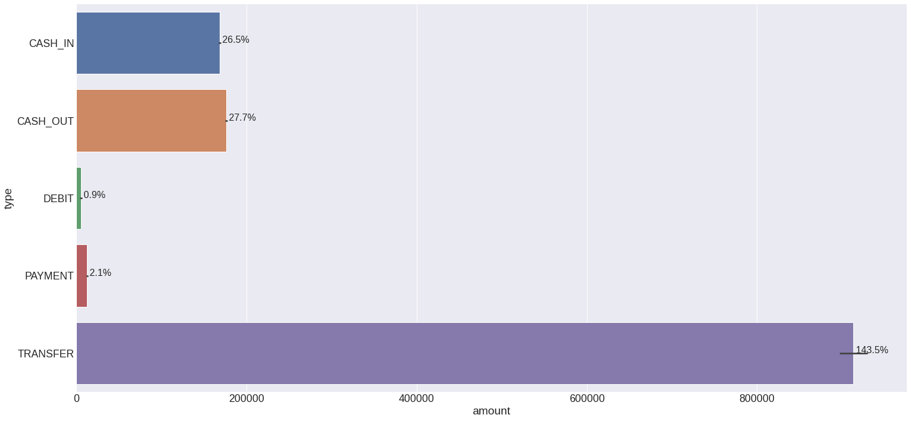

# Transaction Fraud Detection

Henrique Cardoso de Santana @ 2021, UNIFACS University of Salvador.

A Data Science project to predict whether a transaction is a fraud or not.  
Disclaimer: this project was made with academic and research purposes. Any information matching with real-life corporations and scenarios are mere coincidence.

    

 

## 1) Business Problem:

The **NoFraud Company** is a company specialized in detecting fraud in financial transactions made through mobile devices. The company has a service called "NoFraud" which guarantees the blocking of fraudulent transactions.

The business model of the company is of the *SaaS* type, with the monetization made by the performance of the service provided. In other words, the user pays a fee on the success in detecting fraud in the customer's aforementioned transactions.

However, the NoFraud Company is expanding in Brazil, and to acquire customers more quickly, it has adopted a very aggressive strategy. The strategy works as follows:

1. The company will receive *25%* of the value of each transaction truly detected as a fraud;

2. The company will receive *5%* of the value of each transaction detected as a fraud, whilst being truly legitimate;

3. The company will return *100%* of the value to the customer, for each transaction detected as legitimate, whilst it being truly a fraud.

With this aggressive strategy, the company assumes the risks of failing to detect fraud and justifying compensation for assertive fraud detection.

For the customer, it is an excellent business to hire NoFraud. Although the fee charged is very high on success, 25%, the company reduces its costs with fraudulent transactions detected correctly and even the damage caused by an error in the anti-fraud service will be covered by the NoFraud Company itself.

For the company, in addition to getting many customers with this risky strategy to guarantee reimbursement in the event of a failure to detect frauds, it depends only on the precision and accuracy of the models built by its Data Scientists, in other words, the more accurate the “NoFraud” model is, the greater the company's revenue will become. However, if the model has low accuracy, the company could have a huge loss.

## 2) Business Assumptions:

Fraud prevention is the implementation of a strategy to detect fraudulent monetary transactions and prevent these actions from causing financial damage and on the reputation of the company and the financial institution.

There are always financial frauds and They can happen through virtual and physical ways. So the investment in security has been increasing.

The losses caused by fraud can reach R\$ 1 billion - which corresponds to half the amount that institutions invest in IT systems aimed at Cybersecurity every year, according to [Febraban's 2020 Banking Technology Survey](https://blog.simply.com.br/tecnologia-bancaria-2020/).

## 3) Solution Strategy:

My solution to solve this problem will be the development of a Data Science project. This project will have a machine learning model which can predict whether a transaction is fraudulent or not.

**Step 01. Data Description:** In this first section, the data will be collected and studied. The missing values will be threated or removed. Finally, an initial data description will be carried out to know the data. Therefore, some calculations of descriptive statistics will be made, such as kurtosis, skewness, media, fashion, median and standard deviation.

**Step 02. Feature Engineering:** In this section, a mind map will be created to assist the creation of the hypothesis and the creation of new features. These assumptions will help in exploratory data analysis and may improve the model scores.

**Step 03. Data Filtering:** Data filtering is used to remove columns or rows that are not part of the business. For example, columns with customer ID, hash code or rows with age that does not consist of human age.

**Step 04. Exploratory Data Analysis:** The exploratory data analysis section consists of univariate analysis, bivariate analysis and multivariate analysis to assist in understanding of the database. The hypothesis created in Step 02 will be tested in the bivariate analysis.

**Step 05. Data Preparation:** In this fifth section, the data will be prepared for machine learning modeling. Therefore, they will be transformed to improve the learning of the machine learning model, thus they can be encoded, oversampled, subsampled or rescaled.

**Step 06. Feature Selection:** After the data preparation in this section, algorithms, like Boruta, will select the best columns to be used for the training of the machine learning model. This reduces the dimensionality of the database and decreases the chances of overfitting.

**Step 07. Machine Learning Modeling:** Step 07 aims to train the machine learning algorithms and how they can predict the data. For validation the model is trained, validated and applied to cross validation to know the learning capacity of the model.

**Step 08. Hyperparameter Fine Tuning:** Firstly selected the best model to be applied in the project, it's important to make a fine tuning of the parameters to improve its scores. The same model performance methods apllied in the Step 07 are used.

**Step 09. Conclusions:** This is a conclusion stage, which the generation capacity model is tested using unseen data. In addition, some business questions are answered to show the applicability of the model in the business context.

**Step 10. Model Deploy:** This is the final step of the data science project. So, in this step, the Flask API is created and the model and the functions are saved to be implemented in the API.

## 4) Top 3 Data Insights:

* #### All the fraud amount is greater than 10.000.

    **TRUE:** The values are greater than 10.000. But it's important to note that the no-fraud values are also greater than 100.000.

    

* #### 60% of fraud transaction occurs using cash-out-type method.

    **FALSE:** The fraudulent transactions occurs in transfer and cash-out type. However they're almost the same value.

    

* #### Values greater than 100.000 occours using transfers-type method.

    **FALSE:** The majority of the transactions occurs in transfer-type. However, transactions greater than 100.000 occur in cash-in/cash-out as well.

    

## 5) Machine Learning Applied:

Here are all cross validation results of the machine learning models with their default parameters. The cross validation method is important to show the capacity of the model to learn.

#### Dummy Model

| Balanced Accuracy |  Precision  |    Recall   |      F1     |      Kappa     |
|:-----------------:|:-----------:|:-----------:|:-----------:|:--------------:|
|   0.499 +/- 0.0   | 0.0 +/- 0.0 | 0.0 +/- 0.0 | 0.0 +/- 0.0 | -0.001 +/- 0.0 |

#### Logistic Regression

| Balanced Accuracy |  Precision  |      Recall     |        F1       |      Kappa      |
|:-----------------:|:-----------:|:---------------:|:---------------:|:---------------:|
|  0.565 +/- 0.009  | 1.0 +/- 0.0 | 0.129 +/- 0.017 | 0.229 +/- 0.027 | 0.228 +/- 0.027 |

#### K Nearest Neighbors

| Balanced Accuracy |    Precision    |      Recall     |        F1       |      Kappa      |
|:-----------------:|:---------------:|:---------------:|:---------------:|:---------------:|
|  0.705 +/- 0.037  | 0.942 +/- 0.022 | 0.409 +/- 0.074 | 0.568 +/- 0.073 | 0.567 +/- 0.073 |

#### Support Vector Machine

| Balanced Accuracy |  Precision  |     Recall     |        F1        |      Kappa      |
|:-----------------:|:-----------:|:--------------:|:----------------:|:---------------:|
|  0.595 +/- 0.013  | 1.0 +/- 0.0 | 0.19 +/- 0.026 | 0.319 +/- 0.0373 | 0.319 +/- 0.037 |

#### Random Forest

| Balanced Accuracy |    Precision    |      Recall     |        F1       |      Kappa      |
|:-----------------:|:---------------:|:---------------:|:---------------:|:---------------:|
|  0.865 +/- 0.017  | 0.972 +/- 0.014 | 0.731 +/- 0.033 | 0.834 +/- 0.022 | 0.833 +/- 0.022 |

#### XGBoost

| Balanced Accuracy |    Precision    |      Recall     |       F1       |      Kappa     |
|:-----------------:|:---------------:|:---------------:|:--------------:|:--------------:|
|   0.88 +/- 0.016  | 0.963 +/- 0.008 | 0.761 +/- 0.033 | 0.85 +/- 0.023 | 0.85 +/- 0.023 |

#### LightGBM

| Balanced Accuracy |   Precision  |      Recall     |        F1       |      Kappa      |
|:-----------------:|:------------:|:---------------:|:---------------:|:---------------:|
|  0.701 +/- 0.089  | 0.18 +/- 0.1 | 0.407 +/- 0.175 | 0.241 +/- 0.128 | 0.239 +/- 0.129 |

## 6) Machine Learning Performance:

The chosen model was [**XGBoost**](https://xgboost.readthedocs.io/en/stable/) and it was tuned to improve the parameters and scores. Below there's a table with the capacity of the model to learn.

| Balanced Accuracy |    Precision    |      Recall     |        F1       |      Kappa      |
|:-----------------:|:---------------:|:---------------:|:---------------:|:---------------:|
|  0.881 +/- 0.017  | 0.963 +/- 0.007 | 0.763 +/- 0.035 | 0.851 +/- 0.023 | 0.851 +/- 0.023 |

It's possible to determinize the capacity of the model to generalize using unseen data. In other words, capacity of the model to classify new data as shown.

| Balanced Accuracy | Precision | Recall |   F1  | Kappa |
|:-----------------:|:---------:|:------:|:-----:|:-----:|
|       0.915       |   0.944   |  0.829 | 0.883 | 0.883 |

## 7) Business Results:

* #### The company receives 25% of each transaction value truly detected as fraud.

    The company can receive R\$ 60.613.782,88 detecting fraud transactions.

* #### The company receives 5% of each transaction value detected as fraud, however the transaction is legitimate.

    For wrong decisions, the company can receive R\$ 183.866,98.

* #### The company gives back 100% of the value for the customer in each transaction detected as legitimate, however the transaction is actually a fraud.

    The company must return the amount of R\$ 3.546.075,42.

* #### What is the model's Precision and Accuracy?

    For unseen data, the values of balanced accuracy is equal to 91.5% and precision is equal to 94.4%.

* #### How reliable is the model in classifying transactions as legitimate or fraudulent?

    The model can detect 76.3% +/- 3.5% of the fraud. However it detected 0.829 of the frauds from the unseen data.

* #### What is the revenue expected by the company classifying 100% of transactions with the model?

    Using the model, the company can revenue R\$ 60,797,649.86. Using the current method to detect frauds, the revenue is 0.00.

* #### What is the loss expected by the company if it classifies 100% of the transactions with the model?

    For wrong classifications the company must return the amount of R\$ 3,546,075.42. In contrast, for wrong classifications using the current method, the company must return the amount of R\$ 246,001,206.94.

* #### What is the profit expected by the NoFraud company when using the model?

    The company can expect the profit of R\$ 57,251,574.44. The profit value of the current method is R\$ -246,001,206.94.

## 8) Conclusions:

The data is extremely unbalanced. However, it was possible to make all the data analysis and generate models with good scores.

Using the proposed model, the company may expect a revenue of R\$ 57,251,574.44. This result may show the capacity and reliability of the project and help NoFraud.

## 9) Lessons Learned:

* Even when the classes are unbalanced, it's possible to create a model with good scores.

* It is possible to create a model that can classify classes with less than 1% of samples.

## 10) Next Steps

* Test, at most, 10 more hypothesis.

* Implement oversampling or subsampling techniques to improve the model scores.

* Implement the API on the Heroku plataform.

## License

See the [LICENSE](LICENSE) file for details.
